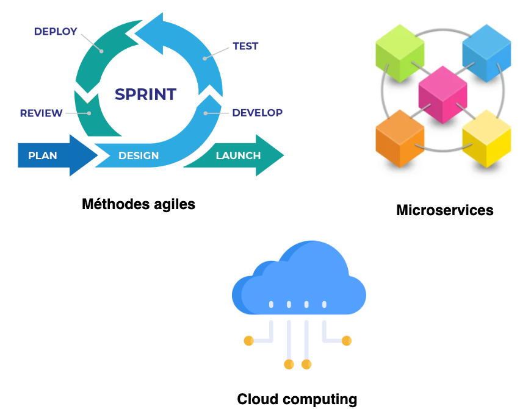
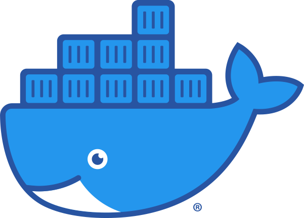
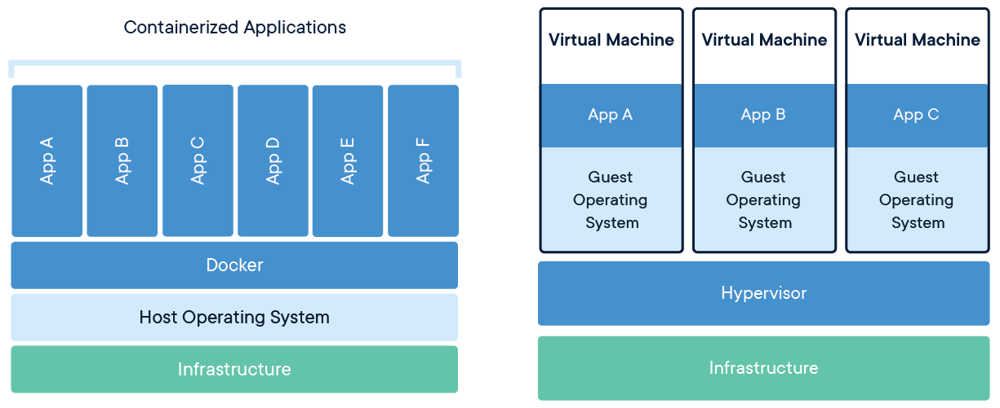

<!-- _class: lead -->

<!-- _header: L3 Informatique • 2022-2023 • Systèmes d'exploitation -->

# Une introduction à Docker et aux conteneurs

 

Thibaud Martinez
thibaud.martinez@dauphine.psl.eu

<!-- _footer:  -->

---

## Évolutions du développement logiciel 

---

## Comment répondre aux nouveaux défis ?

* Déployer plus rapidement des programmes hétérogènes.

* Assurer la portabilité des programmes.

* Gérer l'exécution et la communication de multiples applications.

---

## Docker

 

Docker permet d'**empaqueter** et d'**exécuter** une application dans un environnement isolé appelé **"conteneur"**. 

**Quels avantages ?**
* Livraison rapide et cohérente des applications.
* Déploiement et mise à l'échelle réactifs.
* Exécution d'un grand nombre de charges de travail sur un même matériel.

<!-- _footer: "[Docker overview](https://docs.docker.com/get-started/overview/)" -->

---

## Fonctionnement de Docker

 

---

## Les conteneurs ne sont pas des machines virtuelles !

 

→ Plusieurs conteneurs peuvent fonctionner sur la même machine et **partager le noyau du système d'exploitation avec d'autres conteneurs**, chacun fonctionnant comme **un processus isolé dans l'espace utilisateur**.

<!-- _footer: "[Use containers to Build, Share and Run your applications](https://www.docker.com/resources/what-container/)" -->

---

## Docker s'appuie sur les mécanismes du noyau Linux

Un conteneur est un processus qui est isolé de tous les autres processus sur la machine hôte grâce, notamment, aux :

* **_namespaces_** : partitionne les ressources du noyau de telle sorte qu'un ensemble de processus voit un ensemble de ressources tandis qu'un autre ensemble de processus voit un autre ensemble de ressources.

* **cgroups (control groups)** : pour limiter, compter et isoler l'utilisation des ressources (processeur, mémoire, utilisation disque, etc.).

---

## Docker 101 tutorial

[Play with Docker](https://labs.play-with-docker.com/) est une aire de jeu interactive qui vous permet d'exécuter des commandes Docker sur un terminal Linux, sans aucun téléchargement.

1. Connectez-vous à https://labs.play-with-docker.com/ pour accéder à un terminal.
2. Tapez la commande suivante dans le terminal: `docker run -dp 80:80 docker/getting-started:pwd`
3. Attendez que le conteneur démarre et cliquez sur le badge du port `80`.
4. À vous de jouer !

 

:information_source: Vous pouvez également utiliser [Docker Desktop pour lancer le tutorial](https://www.docker.com/101-tutorial/).

---

## Pour aller plus loin

* [Containers From Scratch • Liz Rice • GOTO 2018](https://www.youtube.com/watch?v=8fi7uSYlOdc)

* [Demystifying Containers - Part I: Kernel Space](https://medium.com/@saschagrunert/demystifying-containers-part-i-kernel-space-2c53d6979504)

* [Docker Documentation](https://docs.docker.com/get-started/)
