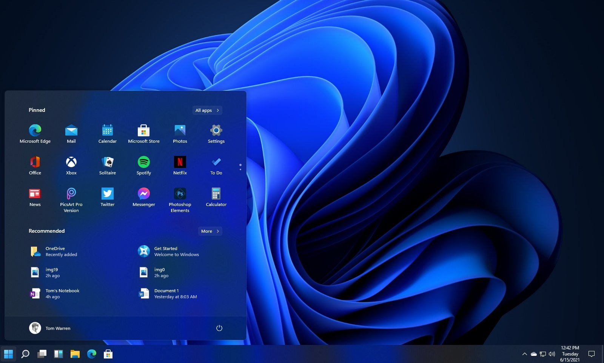
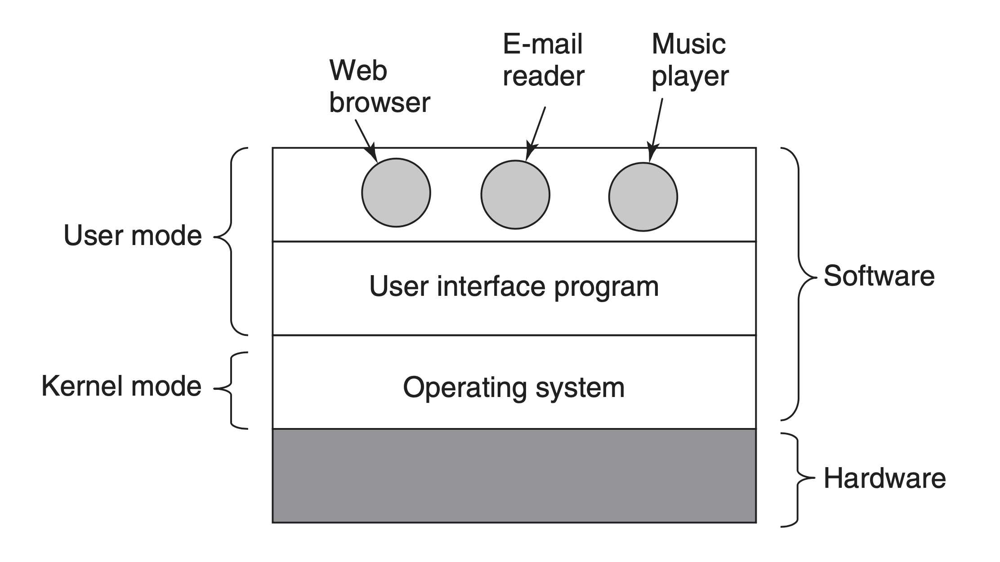
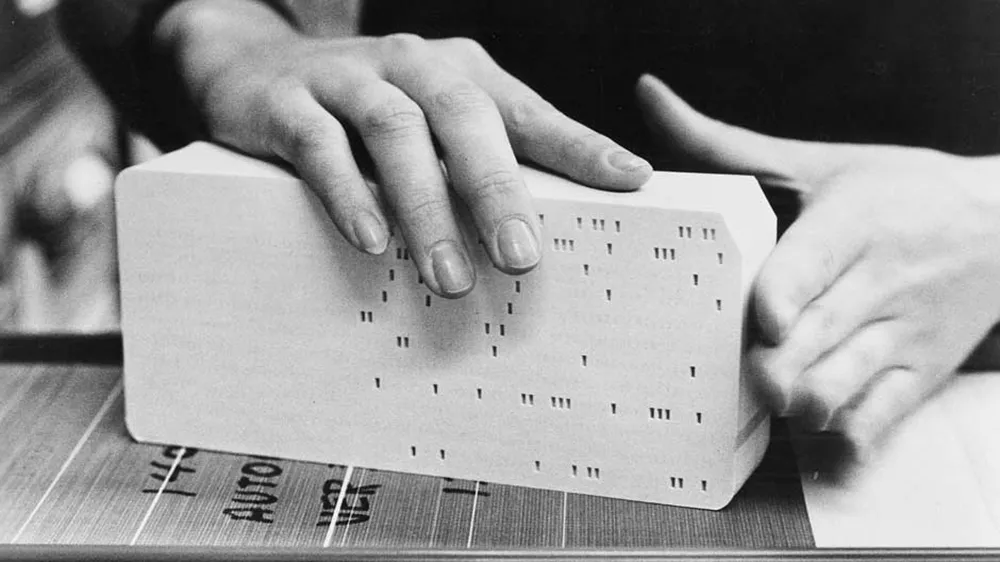
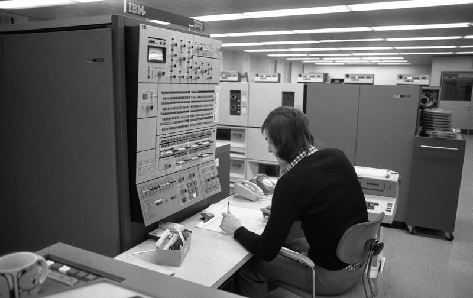
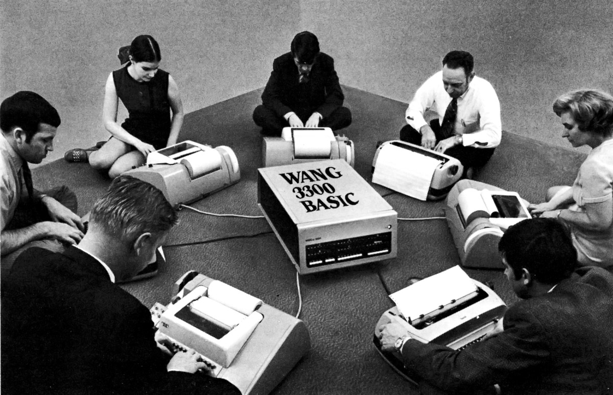
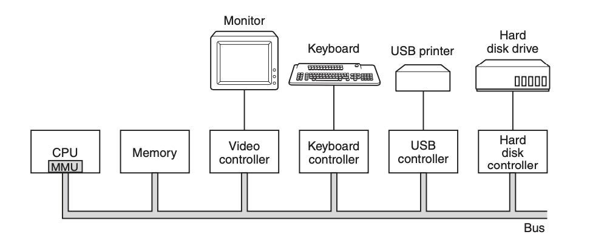
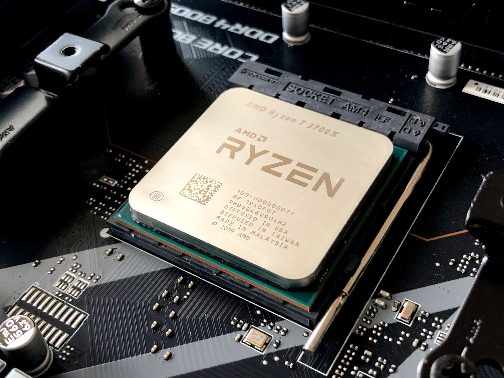
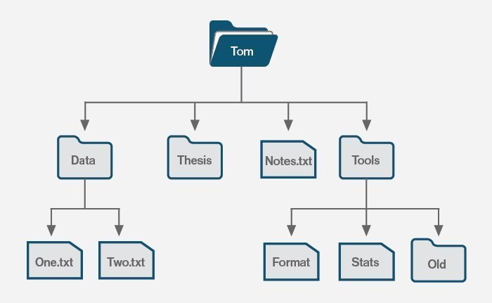
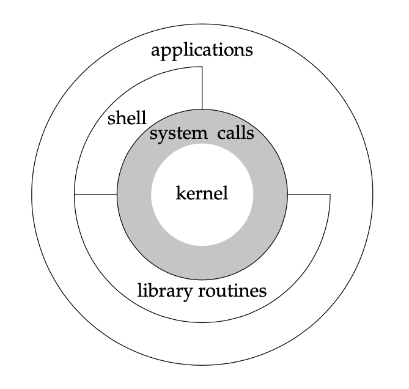

<!-- _class: lead -->

<!-- _header: L3 Informatique • 2022-2023 • Systèmes d'exploitation -->

# Introduction

<br>

Thibaud Martinez 
thibaud.martinez@dauphine.psl.eu

<!-- _footer:  -->

---

Cette présentation couvre le [chapitre 2 de Operating Systems: Three Easy Pieces](https://pages.cs.wisc.edu/~remzi/OSTEP/intro.pdf) et [le chapitre 1 de Modern Operating Systems](https://www.pearson.com/en-us/subject-catalog/p/modern-operating-systems/P200000003311/9780137538638?tab=table-of-contents).

---

## Un système d'exploitation du point de vue de l'utilisateur

 

En réalité, ni la **_GUI (Graphical User Interface)_** (à gauche), ni le **_shell_** (à droite), ne font véritablement partie du système d'exploitation.

---

## Qu'est-ce qu'un système d'exploitation ?

* Un ordinateur est constitué de **matériels** et de **logiciels** qui fonctionnent ensemble pour exécuter des programmes.

* Le **système d'exploitation** fonctionne en **mode noyau** → il a un accès complet à tout le matériel et peut exécuter toute instruction. 

* Le reste du logiciel fonctionne en **mode utilisateur** → seul un sous-ensemble d'instructions de la machine est disponible.



---

**→ Le système d'exploitation est le programme qui s'exécute en mode noyau. Il dirige l'utilisation des ressources d'un ordinateur par des logiciels applicatifs.**

---

### Premier rôle

**Fournir aux programmeurs d'applications (et aux applications) un ensemble abstrait et unifié de ressources au lieu des ressources matérielles désordonnées.**

<br>

**_Exemple : les fichiers_**

Les systèmes d'exploitation fournissent une couche d'abstraction pour l'utilisation des disques : les fichiers. Grâce à cette abstraction, les programmes peuvent lire et écrire dans le stockage sans avoir à s'occuper des détails du fonctionnement réel du matériel.

---

### Second rôle

**Gérer les ressources matérielles et les partager entre les applications.**

* Les ordinateurs sont constitués de processeurs, de mémoires, de disques, d'interfaces réseau, etc. 

* Les systèmes d'exploitation permettent à plusieurs programmes d'être en mémoire et de fonctionner **en même temps**.

* Le système d'exploitation assure une **répartition ordonnée et contrôlée** des processeurs, des mémoires et des périphériques d'entrée/sortie entre les différents programmes qui en ont besoin.

---

### Multiplexage

* **Multiplexage temporel** : différents utilisateurs ou programmes utilisent une ressource à tour de rôle.
    
    _Par exemple, avec un seul processeur et plusieurs programmes, le système d'exploitation alloue d'abord le processeur à un programme, puis, après qu'il ait fonctionné suffisamment longtemps, à un autre, etc._

* **Multiplexage spatial** : au lieu que les utilisateurs se relaient, chacun obtient une partie de la ressource.
    
    _Par exemple, la mémoire principale est généralement partagée entre plusieurs programmes en cours d'exécution._

---

## Une perspective historique : des premiers ordinateurs à Unix

Les systèmes d'exploitation ont historiquement été étroitement liés à l'architecture des ordinateurs sur lesquels ils fonctionnent.

---

### La première génération (1945-55) : les tubes à vide


* Toute la programmation se fait en langage machine, ou en connectant des milliers de câbles à des tableaux de prises pour contrôler les fonctions de base de la machine.

* Les langages de programmation et systèmes d'exploitation sont **inconnus**.

<!-- _footer: Glenn A. Beck and Betty Snyder program ENIAC in BRL building 328. (U.S. Army photo, c. 1947–1955) -->

---

### La deuxième génération (1955-65) : transistors et _batch systems_



* Le **transistor** est utilisé à partir du au milieu des années 1950.

* **_Mainframes_** et **systèmes de traitement par lot** apparaissent.

* Un programmeur doit d'abord écrire le programme (en FORTRAN ou en assembleur), puis le perforer sur des cartes.

* Les systèmes d'exploitation sont le FMS (the Fortran Monitor System) ou IBSYS, le système d'exploitation d'IBM.

<!-- _footer: Cartes perforées IBM -->


---

### La troisième génération (1965–1980): circuits intégrés et multiprogrammation 



* L'IBM 360 est l'une des premières gamme d'ordinateurs à utiliser des circuits intégrés.

* Son système d'exploitation popularise la **multiprogrammation** → pendant qu'une tâche attend la fin des entrées/sorties, une autre tâche peut utiliser le processeur. 

<!-- _footer: Unité centrale IBM System/360 Model 50, console d'opérateur informatique et périphériques chez Volkswagen. -->

---

### _Timesharing_



* Une variante de la multiprogrammation, dans laquelle chaque utilisateur dispose d'un **terminal** connecté à une même unité centrale.

* Si 20 utilisateurs sont connectés et que 17 sont inactifs, le processeur peut être alloué à tour de rôle aux trois tâches qui veulent être exécutées.

<!-- _footer: <a href="https://wang3300.org/">Wang 3300 Computer</a>. -->

---

### Les débuts d'Unix (fin des années 1960)

* À la fin des années 1960, les Bell Labs participent à un projet avec le MIT et General Electric pour développer un système de _timesharing_, appelé **Multiplexed Information and Computing Service (Multics)**.

* Après un échec relatif du projet, les chercheurs _Ken Thompson_, _Dennis Ritchie_, _Douglas McIlroy_ et _Joe Ossanna_, décident de mobiliser leurs expériences dans un nouveau projet de plus petite envergure. **C'est la naissance d'Unix**. 


<!-- _footer: Kenneth Thompson (à gauche) et Dennis Ritchie (à droite). -->

---

### La popularisation d'Unix (années 1970-1980)

* À l'origine écrit en langage assembleur, Unix est **réécrit en C**, dans sa version 4 (1973).

* En raison d'un procès antitrust antérieur lui interdisant d'entrer dans le secteur informatique, AT&T se trouve contraint d'accorder une licence pour le code source d'Unix à quiconque le demande.

* Ainsi, Unix se développe rapidement dans les institutions académiques et les entreprises.

---

### GNU/Linux


* Le **projet GNU**, lancé en 1983 par Richard Stallman, a pour objectif de créer un "système logiciel complet compatible avec Unix" composé entièrement de logiciels libres.

* En 1991, Linus Torvalds crée le **noyau Linux**. L'association de Linux avec GNU permet de créer un système d'exploitation libre.

* On parle d'**Unix-like** : un système qui fonctionne comme un système Unix, bien qu'il ne soit pas nécessairement certifié.

---

### Unix aujourd'hui

* Unix a donné naissance à une vaste famille de systèmes d'exploitation :
    * BSD (notamment FreeBSD, NetBSD et OpenBSD)
    * GNU/Linux
    * iOS et macOS

* Le système d'exploitation mobile Android est basé sur le noyau Linux.

* La plupart des [sites web fonctionnent avec des systèmes d'exploitation basés sur Linux](https://w3techs.com/technologies/details/os-unix) et les [500 superordinateurs les plus puissants du monde utilisent un système d'exploitation basé sur Linux](https://www.top500.org/statistics/details/osfam/1/).

---

## Le matériel informatique (_hardware_)

Le système d'exploitation est lié au matériel de l'ordinateur sur lequel il fonctionne.

<br>



**Modèle d'un ordinateur** : l'unité centrale, la mémoire et les périphériques d'entrée/sortie sont tous reliés par un bus système et communiquent entre eux par son intermédiaire.

---

### Le processeur (_central processing unit - CPU_)

* Le "cerveau" de l'ordinateur : il va chercher les instructions dans la mémoire et les exécute.

* Le **cycle** de base de chaque processeur est de récupérer la première instruction de la mémoire, de la décoder, de l'exécuter, puis de faire de même avec les suivantes.

* Chaque processeur possède un ensemble spécifique d'instructions qu'il peut exécuter. 



---

### Les registres de processeur

* L'accès à la mémoire pour obtenir une instruction ou des données prend beaucoup plus de temps que l'exécution d'une instruction.

* Les processeurs contiennent des zones mémoires très rapides, **les registres**, pour stocker des variables clés et des résultats temporaires. 

---

### Les registres spéciaux

* Le **pointeur d'instruction (_program counter_)** contient l'adresse mémoire de la prochaine instruction à extraire. Une fois l'instruction extraite, le pointeur d'instruction est mis à jour pour pointer vers l'instruction suivante.

* Le **pointeur de pile** indique le haut de la pile d’exécution actuelle en mémoire. La pile d’exécution (_call stack_) est une structure de données qui sert à enregistrer des informations au sujet des fonctions actives dans un programme informatique

* Le **PSW (program status word)** contient des bits de condition et définit notamment le mode du processeur (utilisateur ou noyau).

---

### La mémoire

<br>


<br>

Le système de mémoire est construit comme une **hiérarchie de couches**. Les couches supérieures ont une vitesse plus élevée, une capacité plus faible et un coût par bit plus élevé que les couches inférieures, souvent par des facteurs d'un milliard ou plus.

---

* Les **registres** sont internes au processeur. Ils sont aussi rapides que ce dernier.

* Les **caches** (processeur, mémoire vive, réseau, etc.) enregistrent temporairement des copies de données provenant d'une source, afin de diminuer le temps d'un accès ultérieur (en lecture).

* La mémoire principale est généralement appelée **mémoire vive (_Random Access Memory - RAM_)**.

* **Les disques** → rotatifs (5400, 7200 ou 10 800 tours par minute) ou mémoire flash (_solid-state drive - SSD_).

---

### Les périphériques d'entrée/sortie

* Composés de deux parties :
    
    * Le **contrôleur** est une puce ou un ensemble de puces qui contrôle physiquement le périphérique.
    * Le **périphérique** lui-même.

* Le logiciel qui communique avec un contrôleur, en lui donnant des commandes et en acceptant des réponses, s'appelle un **pilote de périphérique**.

* Pour être utilisé, le pilote doit généralement être intégré au système d'exploitation afin qu'il puisse fonctionner en mode noyau.


---

## Concepts centraux des systèmes d'exploitation

### Processus

Un processus représente un programme en cours d'exécution. 

### Espace d'adressage

* Les systèmes d'exploitation sophistiqués permettent à plusieurs programmes d'être en mémoire en même temps.

* Pour les empêcher d'interférer les uns avec les autres (et avec le système d'exploitation), un mécanisme de protection est nécessaire.

* Chaque processus est associé à son **espace d'adressage**, une liste d'emplacements mémoire qu'il peut lire et écrire.

---

### Système de fichiers



* Le système d'exploitation masque les particularités des disques et des autres périphériques d'E/S pour présenter au programmeur un modèle abstrait.

* Les données sont organisées de manière hiérarchique au sein d'un système de fichiers contenant **fichiers** et **répertoires**.

---


### Appel système (_system call_)

* Un appel système est la manière dont un programme informatique demande un **service** au système d'exploitation sur lequel il est exécuté.

* Les services incluent notamment l'accès au matériel (disque, réseau) ou la création d'un nouveau processus.

---

### Exemple: ouverture d'un fichier

```c
#include <fcntl.h>

int main() {
  int f = open("nouveau.txt", O_RDONLY | O_CREAT);

  if (f == -1) {
    return 1;
  }
  else {
    return 0;
  }
}
```

Avec un système UNIX, l'ouverture d'un fichier se fait en utilisant l'appel système [open](https://man7.org/linux/man-pages/man2/open.2.html).

---

### Le shell

* Un **interpréteur de commandes** qui permet d'accéder au fonctionnalités du système d'exploitation, y compris d'exécuter des programmes.

* La principale **interface** entre un utilisateur et le système d'exploitation, si l'utilisateur n'utilise une interface graphique.

* Il existe de nombreux shells: _sh_, _csh_, _ksh_, _zsh_, _bash_...


---

## L'architecture du système UNIX



<!-- _footer: "[Advanced Programming in the UNIX Environment, 3rd Edition - W. Stevens, Stephen Rago](https://stevens.netmeister.org/631/)" -->

---

## Axes d'étude : virtualisation, concurrence et persistence

### Virtualisation

Chaque application croit qu'elle dispose de toutes les ressources pour elle-même.

* **Processeur** : quantité illimitée d'instructions, exécution continue
* **Mémoire** : la mémoire disponible est illimitée

<br>

_→ Comment partager des ressources limitées ?_

---

### Concurrence

> "Concurrency is about dealing with lots of things at once."
> [_Rob Pike_, Concurrency is not parallelism](https://go.dev/blog/waza-talk)

<br>

Le système d'exploitation doit **gérer les événements concurrents**.

* Masquer la concurrence des processus indépendants.
* Gérer la concurrence des processus dépendants en fournissant des **primitives de synchronisation et de communication**.

    _→ Quelles primitives fournir ?_


---

### Persistence

La durée de vie des informations est supérieure à celle d'un processus.

* Permettre aux processus d'accéder aux **informations non volatiles**.
* **Abstraire** la manière dont les données sont **stockées** (par le biais d'un système de fichiers).
* Être résilient aux pannes.
* Fournir un **contrôle d'accès**.
    
    _→ Comment gérer authentification et permissions ?_
