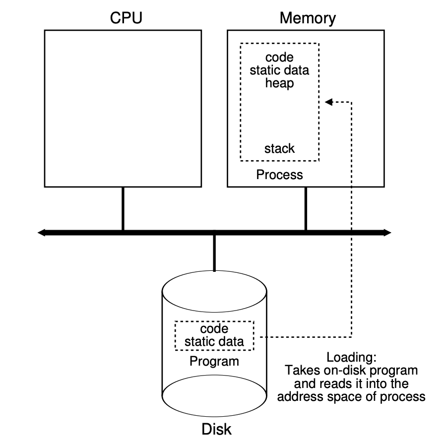
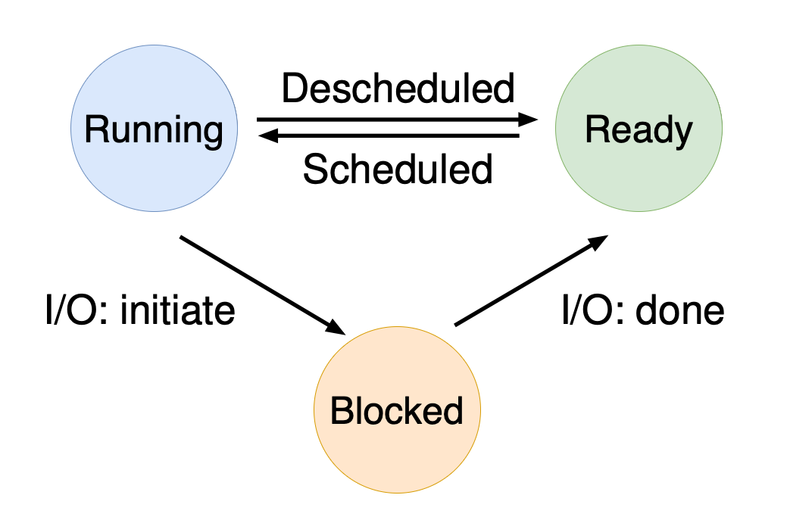
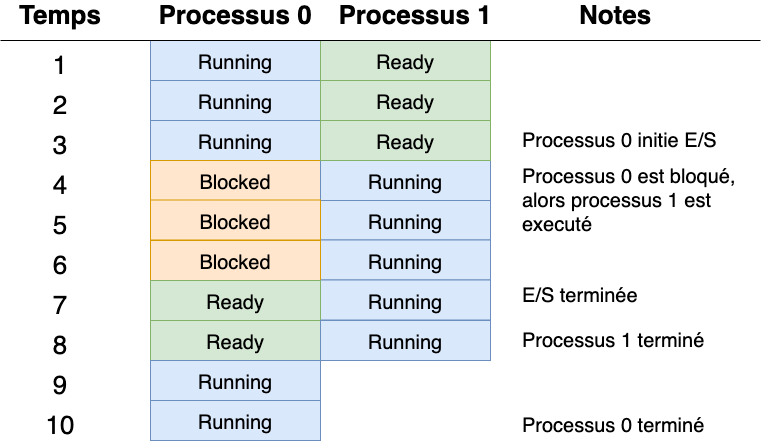

<!-- _class: lead -->

<!-- _header: L3 Informatique • 2022-2023 • Systèmes d'exploitation -->

# Virtualisation (CPU) : les processus

<br>

Thibaud Martinez 
thibaud.martinez@dauphine.psl.eu

<!-- _footer:  -->

---

Cette présentation couvre les chapitres [4](https://pages.cs.wisc.edu/~remzi/OSTEP/cpu-intro.pdf) et [5](https://pages.cs.wisc.edu/~remzi/OSTEP/cpu-api.pdf) de Operating Systems: Three Easy Pieces.

<br>

Les diapositives sont librement inspirées de diapositives de _Youjip Won (Hanyang University)_ et _[Mathias Payer (EPFL)](https://nebelwelt.net/)._

---

## Virtualisation

On veut souvent exécuter plus d'un programme à la fois.

Bien qu'il n'y ait qu'un petit nombre de processeurs physiques disponibles, comment le système d'exploitation peut-il donner **l'illusion** à chaque programme qu'il est **le seul programme en cours d'execution** ?

Les **processus** et la **virtualisation du processeur** fournissent cette abstraction.

---

## L'abstraction : le processus

* Un **programme** est constitué d'instructions statiques et de données, par exemple sur le disque.

* Un **processus** est une instance d'un programme en cours d'exécution.
    _À tout moment il peut y avoir zéro ou plusieurs instances d'un programme en cours d'exécution, par exemple, un utilisateur peut exécuter plusieurs shells simultanément._

---

## Identifiant de processus (_PID - Process Identifier_)

* L'identifiant de processus ou PID  est un code unique attribué sur les systèmes Unix à tout processus lors de son démarrage. 

* Il permet d'identifier le processus dans la plupart des commandes s'appliquant sur un processus donné.

---

## Le processus intéragit avec la machine

* **L'espace d'adressage** représente la mémoire auquelle le processus peut accéder et contient les instructions du programme ainsi que ses données lues et écrites.

* Des instructions lisent ou mettent à jour les **registres** y compris certains registres spéciaux (pointeur d'instruction, pointeur de pile, etc.).

* Les programmes accèdent souvent à des périphériques (disques, réseau, etc.). L'état machine inclut une liste des **fichiers** utilisés pour les entrées/sorties.

---

## Virtualiser le processeur grâce au _timesharing_


* Le système d'exploitation exécute un processus, puis en l'arrête et en exécute un autre, et ainsi de suite.

    → Donne l'illusion que de nombreux processeurs virtuels existent alors qu'il n'y a qu'un seul processeur physique.

*  Les utilisateurs exécutent autant de processus simultanés qu'ils le souhaitent ; le coût potentiel est la performance.

---

## Multiplexage temporel et multiplexage spatial 

* **Multiplexage temporel (_time sharing_)** : différents programment utilisent une ressource à tour de rôle.
    
* **Multiplexage spatial (_space sharing_)**: une ressource est divisée (dans l'espace) entre ceux qui ceux qui souhaitent l'utiliser
    
    _Par exemple, la mémoire principale est généralement partagée entre plusieurs programmes en cours d'exécution._

---

## Implémenter la virtualisation du processeur

Il faut faire appel à :

* **Des mécanismes de bas niveau**
    
    Par exemple, on verra plus tard comment mettre en œuvre une **commutation de contexte (_context switch_)**, qui donne au système d'exploitation la possibilité d'arrêter l'exécution d'un programme et d'en lancer un autre sur une unité processeur donné.

* **Une stratégie de haut niveau**

    _A quels moments faire appel aux mécanismes de bas niveau ?_

---

## Comment les programmes sont transformés en processus ?

1. **Chargement du code du programme en mémoire, dans l'espace d'adressage du processus.**
    * Les programmes résident initialement sur le disque au format exécutable. 

2. **La pile d'exécution (_call stack_) du programme est allouée.**
    * Utiliser la pile pour les _variables locales_, les _arguments des fonctions_ et l'_adresse de retour_.
    * Initialiser la pile avec les arguments : _argc_ et le tableau _argv_ de la fonction `main`.

---

3. **Le tas (_heap_) du programme est créé.**
    * Utilisé pour les données dynamiquement allouées explicitement demandées.
    * Le programme demande de l'espace mémoire en appelant `malloc` et le libère en appelant `free`.

4. Le système d'exploitation effectue d'autres **tâches d'initialisation**.
    * Configuration des **entrées/sorties**.
    * Chaque processus a, par défaut, trois descripteurs de fichiers ouverts : entrée (_stdin_), sortie (_stdout_) et erreur (_stderr_) standard.

5. **Lancement du programme à partir du point d'entrée, à savoir `main`.**
    * Le système d'exploitation transfère le contrôle du processeur au processus nouvellement créé.

---




---

## États d'un processus

Un processus peut être dans l'un des trois états suivants :

* **En cours d'exécution (_running_)** : Le processus est en cours d'exécution sur un processeur. Il exécute des instructions.

* **Prêt (_ready_)** : Le processus est prêt à être exécuté mais pour une raison quelconque, le système d'exploitation a choisi de ne pas l'exécuter à ce moment précis.

* **Bloqué (_blocked_)** : Le processus a effectué une opération qui le rend inactif jusqu'à ce qu'un autre événement se produise.
    _Exemple : lorsqu'un processus effectue une demande d'entrée/sortie sur un disque._

---

## Ordonnancement (_scheduling_)

Un processus peut être être déplacé entre les états _prêt_ et _en cours d'exécution_ à la discrétion du système d'exploitation.



---

## Ordonnancement : exemple avec deux processus

_On suppose qu'il n'existe qu'un unique processeur dans le système._

<br>


---

## Ordonnancement : exemple avec deux processus et des entrées/sorties




<br>

Le système d'exploitation doit prendre de nombreuses décisions, même dans cet exemple simple. Ces types de décisions sont prises par l'**ordonnanceur du système d'exploitation**, un sujet que nous aborderons plus tard.

---

## Structures de données du système d'exploitation

Le système d'exploitation possède des structures de données clés qui stockent des éléments d'information pertinents.

* **Liste de processus**
    * Processus en cours d'exécution
    * Processus bloqués
    * Processus prêts

* **Contexte de registre** : contient, pour un processus arrêté, le contenu de ses registres.

* **Bloc de contrôle de processus** ou _PCB_ (_process control block_) représente l'état d'un processus.

---

## Exemple : les structures de données processus du kernel xv6 (1)

```c
// the registers xv6 will save and restore
// to stop and subsequently restart a process
struct context {
    int eip;
    int esp;
    int ebx;
    int ecx;
    int edx;
    int esi;
    int edi;
    int ebp;
};

// the different states a process can be in
enum proc_state { UNUSED, EMBRYO, SLEEPING, RUNNABLE, RUNNING, ZOMBIE };
```

<!-- _footer: https://github.com/mit-pdos/xv6-public -->

---

## Exemple : les structures de données processus du kernel xv6 (2)

```c
// the information xv6 tracks about each process
// including its register context and state
struct proc {
    char *mem;                  // Start of process memory
    uint sz;                    // Size of process memory
    char *kstack;               // Bottom of kernel stack for this process
    enum proc_state state;      // Process state
    int pid;                    // Process ID
    struct proc *parent;        // Parent process
    void *chan;                 // If !zero, sleeping on chan
    int killed;                 // If !zero, has been killed
    struct file *ofile[NOFILE]; // Open files
    struct inode *cwd;          // Current directory
    struct context context;     // Switch here to run process
    struct trapframe *tf;       // Trap frame for the  current interrupt
};
```

<!-- _footer: https://github.com/mit-pdos/xv6-public -->

---

Des structures de données similaires (mais plus complexes) existent dans le noyau Linux. Pour en apprendre davantage à ce sujet on pourra se référer à l'article [Anatomy of Linux process management - IBM Developer](https://developer.ibm.com/tutorials/l-linux-process-management/).

---

## L'API des processus

Un ensemble d'appels système permet à un processus se contrôler et de contrôler d'autres processus :

* [`fork`](https://man7.org/linux/man-pages/man2/fork.2.html) crée un nouveau processus enfant (une copie du processus) ;
* [`exec`](https://man7.org/linux/man-pages/man3/exec.3.html) exécute un nouveau programme ;
* [`exit`](https://man7.org/linux/man-pages/man3/exit.3.html) termine le processus en cours ;
* [`wait`](https://man7.org/linux/man-pages/man2/wait.2.html) bloque le processus parent jusqu'à ce que l'enfant se termine.

Ceci n'est qu'un petit sous-ensemble de l'API complexe des processus.

---

## L'appel système `fork`

> fork() creates a new process by duplicating the calling process. The new process is referred to as the child process.  The calling process is referred to as the parent process.

[fork(2) — Linux manual page](https://man7.org/linux/man-pages/man2/fork.2.html)

---

## Demo : `fork`

```c
#include <stdio.h>
#include <stdlib.h>
#include <unistd.h>

int main(int argc, char *argv[]) {
    printf("Bonjour (pid:%d)\n", (int) getpid()) ;
    int rc = fork() ;
    if (rc < 0) {
        // échec du fork
        fprintf(stderr, "échec du fork\n") ;
        exit(1) ;
    } else if (rc == 0) {
        // enfant (nouveau processus)
        printf("Je suis l'enfant (pid:%d)\n", (int) getpid()) ;
    } else {
        // le parent prend ce chemin (main)
        printf("Je suis le parent de %d (pid:%d)\n", rc, (int) getpid()) ;
    }
        return 0 ;
    }
```

---

## L'appel système `wait`

> [...]  these system calls are used to wait for state changes in a child of the calling process, and obtain information about the child whose state has changed.  A state change is considered to be: the child terminated; [...]

[wait(2) — Linux manual page](https://man7.org/linux/man-pages/man2/wait.2.html)

---

## Demo : `wait`

```c
#include <stdio.h>
#include <stdlib.h>
#include <unistd.h>
#include <sys/wait.h>

int main(int argc, char *argv[]) {
    printf("Bonjour (pid:%d)\n", (int) getpid()) ;
    int rc = fork() ;
    if (rc < 0) { // échec du fork
        fprintf(stderr, "échec du fork\n") ;
        exit(1) ;
    } else if (rc == 0) { // enfant (nouveau processus)
        printf("Je suis l'enfant (pid:%d)\n", (int) getpid()) ;
    } else { // le parent prend ce chemin (main)
        int rc_wait = wait(NULL) ;
        printf("Je suis le parent de %d (rc_wait:%d) (pid:%d)\n", 
        rc, rc_wait, (int) getpid()) ;
    }
    return 0 ;
}
```

---

## L'appel système `exec`

> The exec() family of functions replaces the current process image with a new process image.

[exec(3) — Linux manual page](https://man7.org/linux/man-pages/man3/exec.3.html)

* Étant donné le nom d'un exécutable et certains arguments, il charge le code (et les données statiques) de cet exécutable et écrase le segment de code du processus actuel (et les données statiques actuelles) avec celui-ci ; le tas et la pile et d'autres parties de l'espace mémoire du programme sont réinitialisés. 

* Ainsi, il ne crée pas un nouveau processus, mais **transforme le programme en cours d'exécution en un autre programme en cours d'exécution**.

---

## Pourquoi `fork` et `exec` ?

La séparation de `fork` et `exec` est essentielle dans la construction d'un shell Unix, car elle permet au shell d'exécuter du code après l'appel à `fork` mais avant l'appel à `exec`. 

Le code peut **modifier l'environnement du programme sur le point d'être exécuté**.

---

## Exemple : redirection de la sortie

```bash
history > backup.txt
```

La sortie du programme `history` est redirigée vers le fichier de sortie `backup.txt`.

L'interpréteur de commandes accomplit cette tâche de la façon suivante : 

* lorsque le processus enfant est créé, avant d'appeler `exec()`, le shell ferme la sortie standard et ouvre le fichier `backup.txt`;

* de cette façon, toute sortie du programme `history` en cours d'exécution est envoyée dans le fichier au lieu de l'écran.

---

## L'arborescence des processus

* Chaque processus a un processus parent.
* Un processus peut avoir plusieurs processus enfants.
* Chaque processus peut à son tour avoir des processus enfants.

```
 3621  ?        Ss   \_ tmux
 3645  pts/2    Ss+  |   \_ -zsh
 3673  pts/3    Ss+  |   \_ -zsh
 4455  pts/4    Ss+  |   \_ -zsh
27124  pts/1    Ss+  |   \_ -zsh
21093  pts/5    Ss   |   \_ -zsh
10589  pts/5    T    |   |   \_ vim 02-review.md
10882  pts/5    R+   |   |   \_ ps -auxwf
10883  pts/5    S+   |   |   \_ less
21264  pts/7    Ss   |   \_ -zsh
 1382  pts/7    T    |   |   \_ vim /home/gannimo/notes.txt
14368  pts/9    Ss   |   \_ -zsh
29963  pts/9    S+   |       \_ python
```
