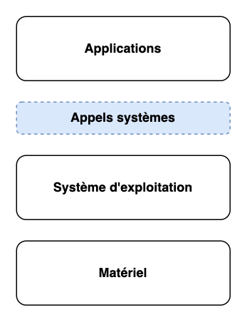
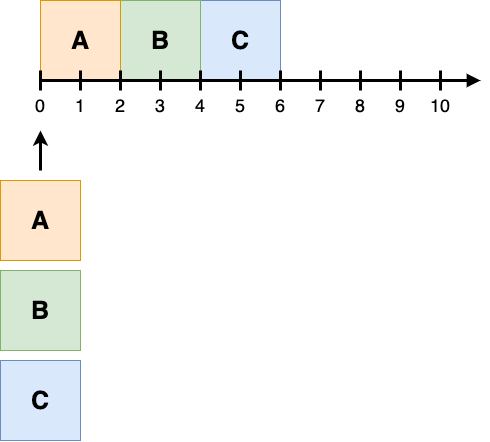
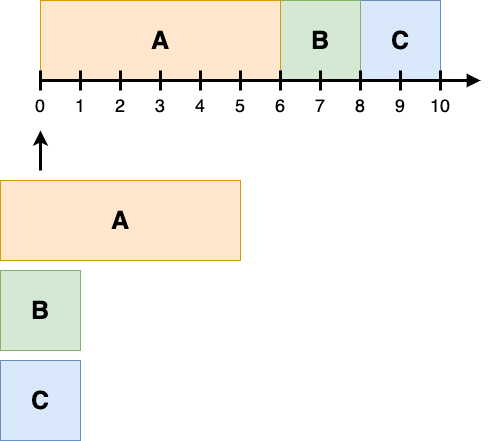
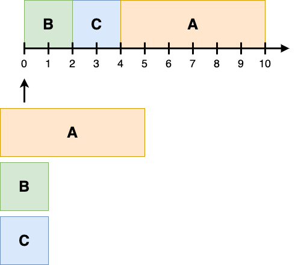
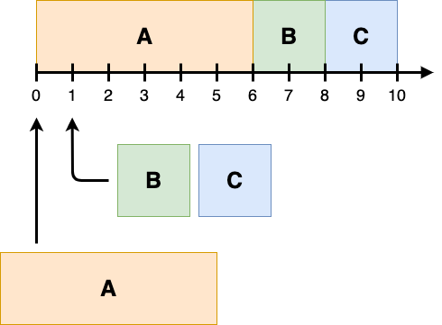
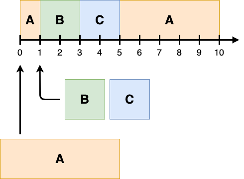
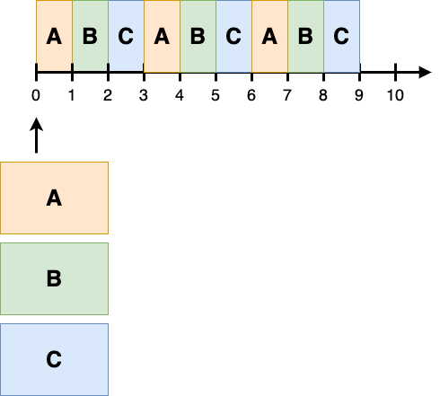
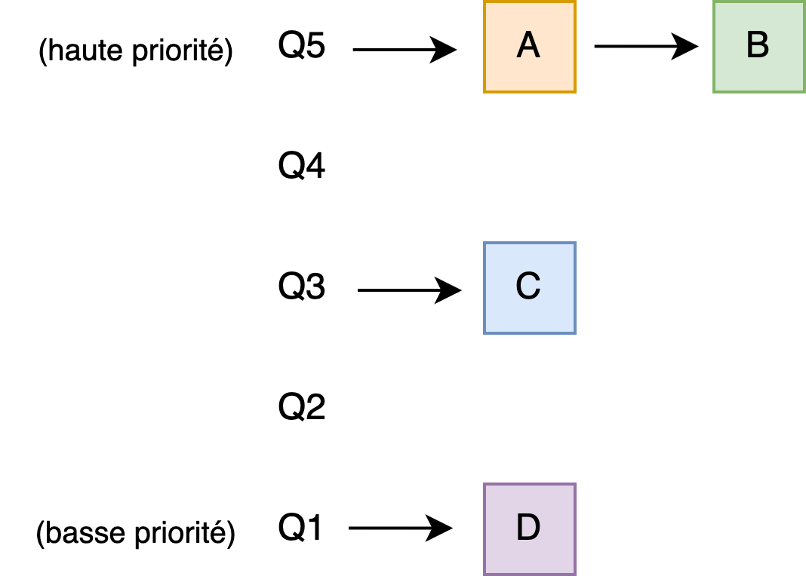

<!-- _class: lead -->

<!-- _header: L3 Informatique • 2022-2023 • Systèmes d'exploitation -->

# Virtualisation (CPU) : ordonnancement

 

Thibaud Martinez 
thibaud.martinez@dauphine.psl.eu

<!-- _footer:  -->

---

Cette présentation couvre les chapitres [6](https://pages.cs.wisc.edu/~remzi/OSTEP/cpu-mechanisms.pdf), [7](https://pages.cs.wisc.edu/~remzi/OSTEP/cpu-sched.pdf) et [8](https://pages.cs.wisc.edu/~remzi/OSTEP/cpu-sched-mlfq.pdf) de Operating Systems: Three Easy Pieces.

 

Les diapositives sont librement inspirées de diapositives de _Youjip Won (Hanyang University)_ et _[Mathias Payer (EPFL)](https://nebelwelt.net/)._

---

## Comment virtualiser efficacement le processeur tout en gardant le contrôle ?

→ Le système d'exploitation doit partager le processeur en _timesharing_.

 

_Problèmes :_

* **Performance** : comment mettre en œuvre la virtualisation sans ajouter une surcharge excessive au système ? 

* **Contrôle** : comment exécuter des processus de manière efficace tout en gardant le contrôle du CPU ?

---

## Exécution directe

Pour une exécution performante, il suffit d'**exécuter le programme directement sur le CPU**.

 

_Problème_ : par définition, lorsque le programme est exécuté sur le processeur, le noyau ne l'est pas. **Il faut limiter l'exécution des programmes utilisateur**. Sans limites, le système d'exploitation ne contrôlerait rien.

---

## Solution : exécution directe limitée

Deux modes d'exécution sont supportés par le processeur :

* **Mode utilisateur** : les programmes n'ont pas un accès complet aux ressources matérielles.
* **Mode noyau** : le système d'exploitation a accès à l'ensemble des ressources de la machine.

 

Un bit, appelé **bit de mode**, est présent dans le processeur pour indiquer le mode actuel : noyau (0) ou utilisateur (1).

---

## Problème : opérations restreintes

Que faire si un processus souhaite effectuer une opération restreinte comme :
* envoyer une requête d'écriture à un disque;
* obtenir l'accès à plus de ressources système telles que le CPU ou la mémoire ?

---

## Solution : appels systèmes (_system calls_)

Permettent au noyau d'exposer des services au programme qui s'exécute en mode utilisateur :
* accéder au système de fichiers;
* créer et détruire des processus;
* communiquer avec d'autres processus;
* allouer de la mémoire supplémentaire...

---

## Appels systèmes

 

**Remarque** : Sur les processeurs x86, l'instruction trap s'appelle [`INT`](https://en.wikipedia.org/wiki/INT_(x86_instruction)).

---

## Problème : passage d'un processus à l'autre

Comment le système d'exploitation peut-il reprendre le contrôle du processeur afin de pouvoir passer d'un processus à l'autre ?

---

## Solution 1 : une approche coopérative

* **Les processus abandonnent périodiquement le processeur** en effectuant des appels système tels que [`yield`](https://man7.org/linux/man-pages/man2/sched_yield.2.html).

* Les processus transfèrent également le contrôle au système d'exploitation lorsqu'ils font quelque chose d'illégal, tels que :
    * diviser par zéro;
    * essayer d'accéder à une zone mémoire à laquelle ils ne devraient pas pouvoir accéder.

 

**Problème : un processus peut rester coincé dans une boucle infinie et vous devez redémarrer la machine.**

---

## Solution 2 : une approche non coopérative

Pendant la séquence de démarrage, le système d'exploitation lance une minuterie. **La minuterie génère une interruption toutes les quelques millisecondes**.

Quand une interruption se produit :
* Le processus en cours d'exécution est arrêté.
* L'état du programme est sauvegardé.
* Un gestionnaire d'interruption préconfiguré dans le système d'exploitation s'exécute.

 

**Une interruption de minuterie donne au noyau la possibilité de s'exécuter à nouveau sur le processeur.**

---

## Sauvegarde et restauration du contexte

Lors d'une interruption du processus utilisateur (volontaire ou non), l'ordonnanceur prend une **décision** : continuer à exécuter le processus en cours, ou passer à un autre.

Si la décision de basculer est prise, le système d'exploitation effectue une **commutation de contexte**.

---

## Commutation de contexte (_context switch_)

Une commutation de contexte est un mécanisme qui :
1. sauvegarde l'état du processus en cours (valeurs des registres notamment), dans une structure du noyau;
2. restaure l'état du processus à exécuter ensuite;
3. transfère le contrôle du processeur au processus suivant.

 

**Remarque** : une commutation de contexte est transparent pour le processus.

---

## Raisons d'une commutation de contexte

* Le processus se termine.
* Le processus effectue une opération d'E/S lente et le système d'exploitation passe à une autre tâche qui est prête.
* Le matériel nécessite l'aide du système d'exploitation et émet une interruption.
* Le système d'exploitation décide de préempter le processus et de passer à une autre (c'est-à-dire que le processus a épuisé sa tranche de temps).

---

## Politique d'ordonnancement

_Bas niveau_ : le mécanisme de **commutation de contexte** s'occupe de la manière dont le noyau passe d'un processus à l'autre.

_Haut niveau_ : la **politique d'ordonnancement** détermine quel processus doit être exécuté ensuite.

→ S'il n'y a qu'un seul processus "prêt", la réponse est simple. S'il y a plusieurs
processus, la politique décide de l'ordre d'exécution des processus.

---

## Mesures de l'ordonnanceur

* **Utilisation** : quelle fraction du temps le CPU exécute-t-il un programme ?
  (objectif : maximiser)

* **Temps de traitement (_turnaround time_)** : temps global total entre la création et l'aboutissement d'un processus.  (objectif : minimiser)

* **Temps de réponse (_response time_)** : temps entre le moment où le processus est prêt et celui où il est ordonnancé (objectif : minimiser)

* **Équité (_fairness_)** : tous les processus obtiennent la même quantité de CPU au fil du temps (objectif : pas de famine).

* **Progrès** : permettre aux processus de progresser (objectif : minimiser les interruptions du noyau).

---

## Rappel : états des processus

---

## Hypothèses d'ordonnancement

* Chaque tâche est exécutée pendant la même durée.
* Toutes les tâches arrivent au même moment.
* Toutes les tâches n'utilisent que le CPU (pas d'E/S).
* Le temps d'exécution des tâches est connu.
* Un seul processeur.

---

## _First-in, first-out_ (FIFO)

 

* Les tâches A, B, C de `taille=2` arrivent à `T=0`.
* Temps de traitement moyen : `(2+4+6)/3 = 4`
* Temps de réponse moyen : `(0+2+4)/3 = 2`

 

Constat : facile, simple, direct. Quels sont les inconvénients ?

---

## Hypothèses d'ordonnancement

* ~~**Chaque tâche est exécutée pendant la même durée.**~~
* Toutes les tâches arrivent au même moment.
* Toutes les tâches n'utilisent que le CPU (pas d'E/S).
* Le temps d'exécution des tâches est connu.

---

## Défi FIFO : tâche longue

* La tâche A est maintenant de `taille=6`.
* Temps de traitement moyen : `(6+8+10)/3 = 8`
* Temps de réponse moyen : `(0+6+8)/3 = 4.7`

 

Constat : les tâches longues retardent les tâches courtes, les délais d'exécution/de réponse en souffrent !

---

## Shortest job first (SJF)

Choisit la tâche prête avec le temps d'exécution le plus court.

* La tâche A est de `taille=6`.
* Temps de traitement moyen : `(2+4+10)/3 = 5.3`
* Temps de réponse moyen : `(0+2+4)/3 = 2`

---

## Hypothèses d'ordonnancement

* ~~Chaque tâche est exécutée pendant la même durée.~~
* ~~**Toutes les tâches arrivent au même moment.**~~
* Toutes les tâches n'utilisent que le CPU (pas d'E/S).
* Le temps d'exécution des tâches est connu.

---

## SJF : une autre file de tâches

* Les tâches B et C arrivent maintenant à 1.
* Temps de traitement moyen : `(6+7+9)/3 = 7.3`
* Temps de réponse moyen : `(0+5+7)/3 = 4`

 

Constat : les tâches longues ne peuvent pas être interrompues et retardent les tâches courtes.

---

## Ordonnancement préemptif

* Les ordonnanceurs précédents (FIFO, SJF) sont **non-préemptifs**. Les ordonnanceurs non-préemptifs ne passent à un autre processus que si le processus actuel abandonne le CPU volontairement.

* Les ordonnanceurs **préemptifs** peuvent prendre le contrôle du CPU à tout moment, en passant à un autre processus selon la politique d'ordonnancement.

---

## Ordonnancement préemptif : STCF

Le STCF (_shortest time to completion first_), exécute toujours le travail qui se termine le plus rapidement.

* Les tâches B et C arrivent à 1.
* Temps de traitement moyen : `(2+4+10)/3 = 5.3`
* Temps de réponse moyen : `(0+0+2)/3 = 0.7`

Constat : ré-ordonnancer à chaque fois que de nouvelles tâches arrivent donne la priorité aux tâches courtes.

---

## Optimiser le temps de réponse

* Jusqu'à présent, nous avons optimisé le **temps de traitement** (c'est-à-dire l'accomplissement des tâches aussi vite que possible).

* Sur un système interactif, le **temps de réponse** (le temps qu'il faut pour qu'une tâche commence à être exécutée) est tout aussi important.

---

## _Round robin (RR)_

Alterne les processus prêts chaque tranche de temps de longueur fixe.

* Tâches A, B, C `taille=3`, arrive à `T=0`
* Temps de réponse moyen :
    * `(0+1+2)/3 = 1` pour RR
    * `(0+3+6)/3 = 3` pour FIFO
* Temps de traitement moyen :
    * `(7+8+9)/3 = 8` pour RR 
    * `(3+6+9)/3 = 6` pour SJF

Constat : la réactivité augmente le délai d'exécution (pour des tâches de même durée).

---

## Hypothèses d'ordonnancement

* ~~Chaque tâche est exécutée pendant la même durée.~~
* ~~Toutes les tâches arrivent au même moment.~~
* ~~**Toutes les tâches n'utilisent que le CPU (pas d'E/S).**~~
* Le temps d'exécution des tâches est connu.

---

## Conscience des E/S

* Jusqu'à présent, l'ordonnanceur ne prend en compte que les événements préemptifs (càd le minuteur s'arrête) ou la fin/création de processus pour replanifier.

* Les E/S sont généralement très lentes et peuvent être effectuées de manière asynchrone.

Constat : l'ordonnanceur doit prendre en compte les E/S, le temps inutilisé sera ainsi utilisé par d'autres processus.

---

## Hypothèses d'ordonnancement

* ~~Chaque tâche tourne pendant la même durée~~.
* ~~Toutes les tâches arrivent au même moment~~.
* ~~Toutes les tâches n'utilisent que le CPU (pas d'E/S)~~
* ~~***Le temps d'exécution des tâches est connu***~~.

---

## _Multi-level feedback queue_ (MLFQ)

**Défi** : prendre en charge à la fois les tâches d'arrière-plan de longue durée et des tâches d'avant-plan à faible latence (processus interactifs).

Le MLFQ comporte des **files d'attente distinctes**, chacune avec un niveau de **priorité** différent.

* **Règle 1** : les tâches dans la file avec le niveau de priorité le plus haut, sont exécutées en priorité.

* **Règle 2** : plusieurs tâches peuvent avoir la même priorité, dans ce cas l'ordonnancement _round-robin_ est utilisé entre ces tâches.

---

## MLFQ : exemple

 

---

## Comment ajuster les priorités ?

Plutôt que d'accorder une priorité fixe à chaque tâche, MLFQ fait varier la priorité d'une tâche en fonction de son comportement observé.

* **Règle 3** : les nouvelles tâches ont la priorité la plus élevée (la file d'attente la plus haute).

* **Règle 4a** : si une tâche utilise une tranche de temps entière pendant son exécution, sa priorité est réduite (c'est-à-dire qu'elle descend d'une file d'attente).

* **Règle 4b** : si une tâche abandonne le CPU avant la fin de la tranche de temps, elle reste au même niveau de priorité.

---

## Comment gérer le risque de famine ? 

Les tâches de faible priorité risquent de ne jamais être exécutées sur un système occupé.

 

* **Règle 5** : toutes les tâches sont déplacées périodiquement vers la file d'attente la plus prioritaire.

---

## Comment gérer les processus qui tenteraient de tricher ?

Un processus de haute priorité pourrait céder le CPU avant que sa tranche de temps ne soit écoulée, restant ainsi en haute priorité.

_→ Il faut tenir compte du temps total d'exécution d'une tâche à un niveau de priorité donné_.

 

* **Règle 4** : lorsqu'une tâche a épuisé son temps alloué à un niveau donné (quel que soit le nombre de fois où elle a renoncé au CPU), sa priorité est réduite.

---

## Le MLFQ en résumé

* **Règle 1** : les tâches dans la file avec le niveau de priorité le plus haut, sont exécutées en priorité.

* **Règle 2** : plusieurs tâches peuvent avoir la même priorité, dans ce cas l'ordonnancement _round-robin_ est utilisé entre ces tâches.

* **Règle 3** : les nouvelles tâches ont la priorité la plus élevée.

* **Règle 4** : lorsqu'une tâche a épuisé son temps alloué à un niveau donné, sa priorité est réduite.

* **Règle 5** : toutes les tâches sont déplacées périodiquement vers la file d'attente la plus prioritaire.

---

## Pour aller plus loin

* Sur le coût en termes de performance d'un _context switch_ pour un serveur web : [Ryan Dahl: Node JS (vidéo)](https://www.youtube.com/watch?v=EeYvFl7li9E).

* Une approche d'ordonnancement qui essaye de garantir que chaque tâche obtienne un certain pourcentage de temps CPU : [Scheduling: Proportional Share](https://pages.cs.wisc.edu/~remzi/OSTEP/cpu-sched-lottery.pdf).

* L'ordonnanceur actuel de Linux : [Inside the Linux 2.6 Completely Fair Scheduler](https://developer.ibm.com/tutorials/l-completely-fair-scheduler/).
