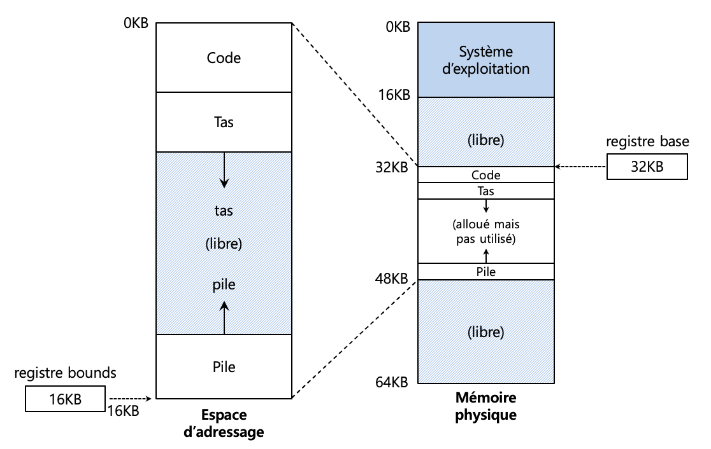
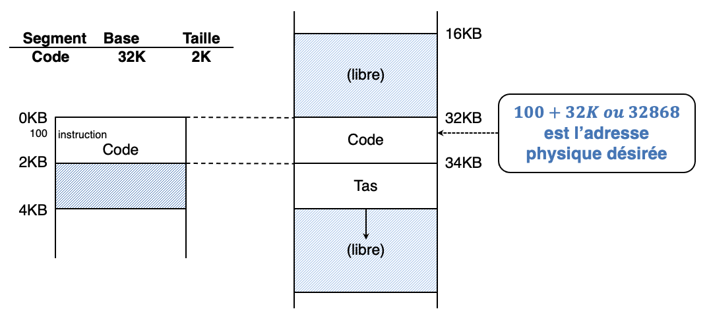
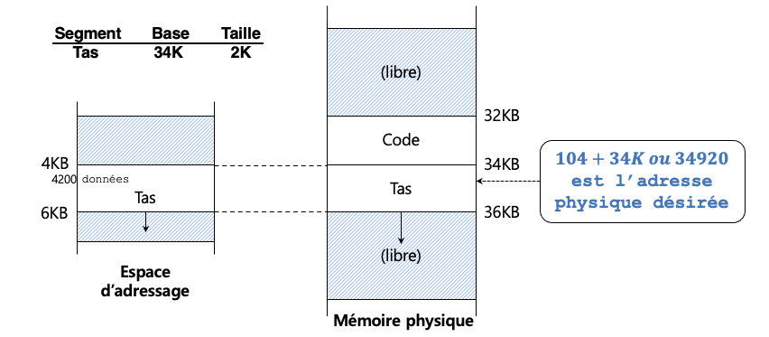
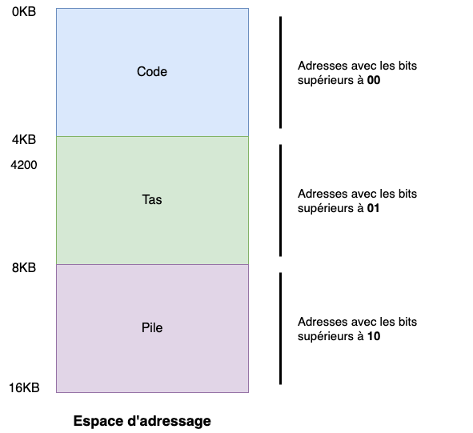
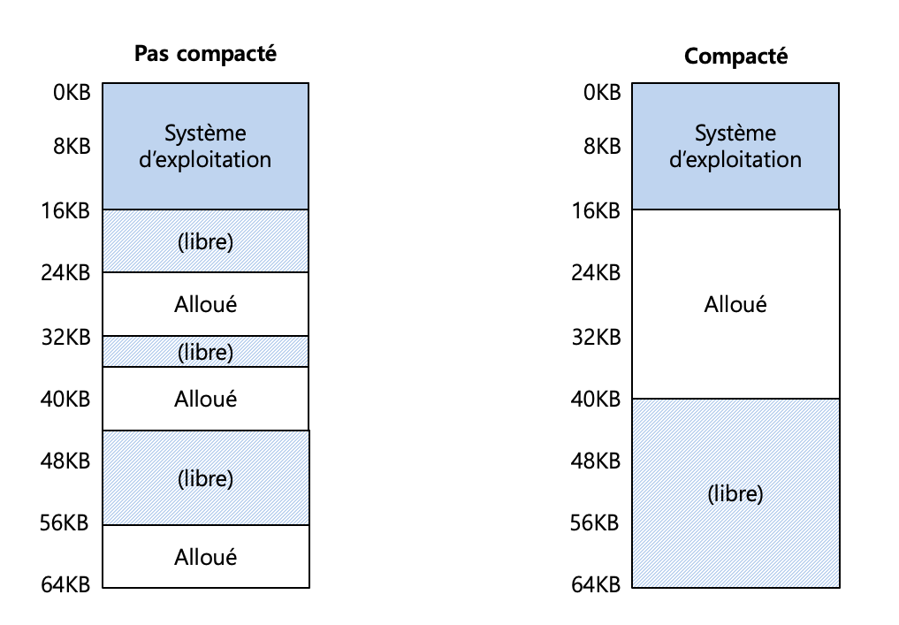

<!-- _class: lead -->

<!-- _header: L3 Informatique • 2022-2023 • Systèmes d'exploitation -->

# Virtualisation (mémoire) : segmentation

<br>

Thibaud Martinez
thibaud.martinez@dauphine.psl.eu

<!-- _footer:  -->

---

Cette présentation couvre les chapitres [13](https://pages.cs.wisc.edu/~remzi/OSTEP/vm-intro.pdf), [14](https://pages.cs.wisc.edu/~remzi/OSTEP/vm-api.pdf), [15](https://pages.cs.wisc.edu/~remzi/OSTEP/vm-mechanism.pdf) et [16](https://pages.cs.wisc.edu/~remzi/OSTEP/vm-segmentation.pdf) de Operating Systems: Three Easy Pieces.

<br>

Les diapositives sont librement adaptées de diapositives de _Youjip Won (Hanyang University)_.

---

## Qu'est-ce que la virtualisation de la mémoire ?

Le système d'exploitation fournit l'illusion au processus qu'il est le seul à utiliser 
la mémoire et qu'il peut l'utiliser en totalité.

---

## Pourquoi virtualiser la mémoire ?

* Facilité d'utilisation pour la programmation.
* Efficacité de la mémoire en termes de temps et d'espace.
* Garantie d'isolation pour les processus et le système d'exploitation.
  → Protection contre les accès erronés depuis d'autres processus

---

## Les premiers systèmes d'exploitation

Chargement d'un seul processus en mémoire.


---

## Multiprogrammation et _time sharing_

<div class="columns">
<div>

Chargement de plusieurs processus en mémoire.
* Exécuter un processus pendant une courte période.
* Passer d'un processus à l'autre en mémoire.

→ Augmenter l'utilisation et l'efficacité.

Problème de protection : **accès erronés à la mémoire par d'autres processus**.

</div>
<div>


</div>

---

## Espace d'adressage

<div class="columns">
<div>

* Le système d'exploitation crée une abstraction de la mémoire physique.

* Il s'agit d'une "vue" de la mémoire physique pour un processus.

* L'espace d'adressage contient tout ce qui concerne un processus en cours d'exécution : code du programme, du tas, de la pile, etc.

</div>
<div>


</div>

---

<div class="columns">
<div>

* **Code**: où se trouvent les instructions.

* **Tas (_heap_)** : pour allouer dynamiquement de la mémoire.
  * `malloc` en langage C

* **Pile (_stack_)**
  * Stocke les adresses de retour ou les valeurs.
  * Contient les variables locales, les arguments des fonctions.

</div>
<div>


</div>


---

## Organisation de l'espace d'adressage : exemple

<br>

<div class="columns">
<div>

```c
#include <stdio.h>
#include <stdlib.h>

int main(int argc, char *argv[]) {
    printf("location of code : %p\n", main);
    printf("location of heap : %p\n", malloc(100e6));
    int x = 3;
    printf("location of stack: %p\n", &x);
    return 0;
}
```

Le résultat sur une machine Linux 64 bits.

```
location of code : 0x40057d
location of heap : 0xcf2010
location of stack : 0x7fff9ca45fcc
```

</div>
<div>


</div>

---

## Adresse virtuelle

* Chaque adresse d'un programme en cours d'exécution est **virtuelle**.
* Le processus a l'impression que son espace d'adressage débute à l'adresse mémoire 0.
* Le système d'exploitation traduit l'**adresse virtuelle** en **adresse physique**.


**Note :** toutes les adresses mémoires affichées par un processus en mode utilisateur sont des adresses virtuelles. 

---

## Comment virtualiser la mémoire avec efficacité et contrôle ?

* Mécanisme de bas niveau assuré par le matériel.
  **Traduction d'adresse** : le matériel transforme une adresse virtuelle en adresse physique. Les données sont en réalité stockées à une adresse physique.

<br>

* Intervention du système d'exploitation pour gérer la mémoire :
    * Quels espaces sont libres ?
    * Quels accès mémoires sont autorisés ? 

---

## Relocalisation de l'espace d'adressage

<div class="columns">
<div>

* Pour le processus l'espace d'adressage débute à l'adresse mémoire 0.

* Le système d'exploitation veut placer le processus à un autre endroit de la mémoire physique, et non à l'adresse 0.

</div>
<div>


</div>
</div>

---

## Relocalisation dynamique, registres _base_ et _bounds_ 

Lorsqu'un programme commence à s'exécuter, le système d'exploitation décide de l'endroit de la mémoire physique où le processus doit être chargé.

* Les registres _**base**_ et _**bounds**_ se voient attribué une valeur.

* `adresse physique = adresse virtuelle + base`

* Les adresses virtuelles ne doivent pas dépasser la valeur `base + bounds`, sinon le processeur lève une exception.

<br>

Les registres _base_ et _bounds_ se trouvent dans une partie du processeur appelée la **memory management unit (MMU)**.

---

## Registres _base_ et _bounds_ 



---

## Exemple de traduction d'adresses


* `base = 16KB`
* `bounds = taille de l'espace d'adressage = 4KB`

<br>

<center>

| Adresse virtuelle |   | Adresse physique      |
|-------------------|---|-----------------------|
| 0                 | → | 16KB                  |
| 1KB               | → | 17KB                  |
| 3000B             | → | 19384B                |
| 4400B             | → | Erreur (hors limites) |

</center>

---

## Limites de l'approche _base_ et _bounds_

* Un gros morceau d'espace "libre" occupe la mémoire physique.
* Difficile de fonctionner lorsqu'un espace d'adressage ne tient pas dans la mémoire physique.

---

## Gestion de la mémoire par le système d'exploitation

1. Lorsqu'un processus est créé le système d'exploitation doit **trouver un emplacement en mémoire pour son espace d'adressage**. Le système d'exploitation maintient une structure de données qui référence les emplacements disponibles (_free list_).

2. Lorsqu'un processus se termine, le système met à jour les emplacements disponibles.

3. Lorsqu'une **commutation de contexte** se produit, le système d'exploitation sauvegarde et restaure l'état des registres _base_ and _bounds_.

---

## Segmentation

La segmentation permet de dépasser les limites de l'approche _base_ and _bounds_.

* Un segment est une portion **contiguë** de l'espace d'adressage d'une longueur donnée.

* Pour un processus donné, on a 3 segments différents : code, pile, tas.

* Chaque segment peut être placé dans une partie différente de la mémoire physique.

* Les registres _base_ et _bounds_ existent pour chaque segment. La MMU contient les registres des segments.

---

## Placer un segment dans la mémoire physique


---

## Traduction d'adresse pour le segment code

<center>

`adresse physique = base + offset`

</center>

L'_offset_ est la position de l'adresse par rapport au début du segment.

Pour le segment code, l'_offset_ de l'adresse virtuelle 100 est 100 car le segment code **débute à l'adresse virtuelle 0 dans l'espace d'adressage.**



---

## Traduction d'adresse pour le tas

⚠️ `adresse virtuelle + base` ne correspond pas à l'adresse physique correcte.

En effet, le segment tas commence à l'adresse virtuelle 4096 (4KB) dans l'espace d'adressage. Ainsi, l'_offset_ de l'adresse virtuelle 4200 est `4200 - 4096 = 104`.



---

## Erreur de segmentation (_segmentation fault_)

Si une adresse illégale, telle que 7 KB, qui se trouve au-delà de la fin du tas, est référencée, le système d'exploitation lève **une erreur de segmentation (_segmentation fault_)**.

Le matériel détecte que l'adresse est hors limites.

---

## Comment faire référence à un segment ?

Le matériel utilise des registres de segments pendant la traduction. Comment sait-il quel est l'_offset_ dans un segment et à quel segment une adresse se réfère ?

**Solution**: découper l'espace d'adressage en segments basés sur les deux bits supérieurs de l'adresse virtuelle.


Exemple : adresse virtuelle 4200 (01000001101000)


---




---

## Traduction d'adresse pour la pile

* La pile croît à l'envers.
* Un support matériel supplémentaire est nécessaire.
* Le matériel vérifie le sens de croissance du segment: 1 : sens positif, 0 : sens négatif

<br>

<center>

| Segment | Base | Taille | Direction |
|---------|------|--------|-----------|
| Code    | 32KB | 2KB    | 1         |
| Tas     | 34KB | 2KB    | 1         |
| Pile    | 28KB | 2KB    | 0         |

Registres de segments

</center>

---

## Partage de segments

Un segment peut être partagé entre espaces d'adressage. 
  → Le partage de code est encore utilisé actuellement.

Un support matériel supplémentaire est nécessaire sous la forme de **bits de protection** : quelques bits supplémentaires par segment indiquent les autorisations de lecture, d'écriture et d'exécution.

<center>

| Segment | Base | Taille | Direction | Protection   |
|---------|------|--------|-----------|--------------|
| Code    | 32KB | 2KB    | 1         | Read-Execute |
| Tas     | 34KB | 2KB    | 1         | Read-Write   |
| Pile    | 28KB | 2KB    | 0         | Read-Write   |

Registres de segments

</center>

---

## Fragmentation et compactage

**Fragmentation externe** : trous d'espace libre dans la mémoire physique qui rendent difficile l'allocation de nouveaux segments.
  * Exemple : Il y a 24 KB d'espace libre, mais pas dans un segment contigu. Le système d'exploitation ne peut pas satisfaire la demande de 20 KB.

**Compactage** : réarrangement des segments existants dans la mémoire physique.
  * Le compactage est coûteux. Il faut arrêtez le processus en cours, copier les données quelque part, et modifier la valeur du registre de segment.

---

