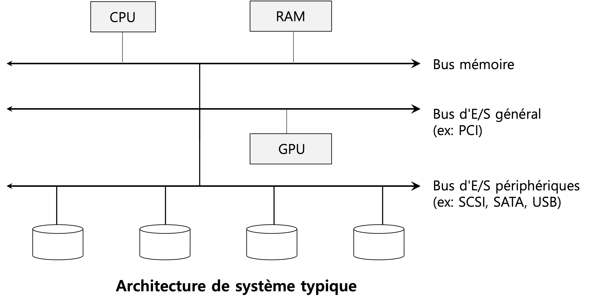
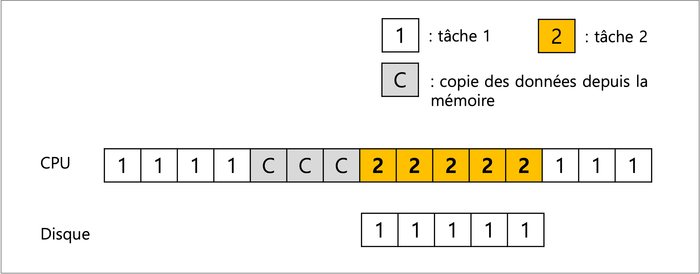
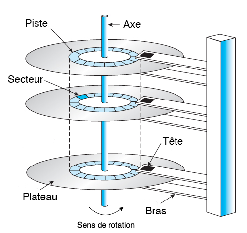
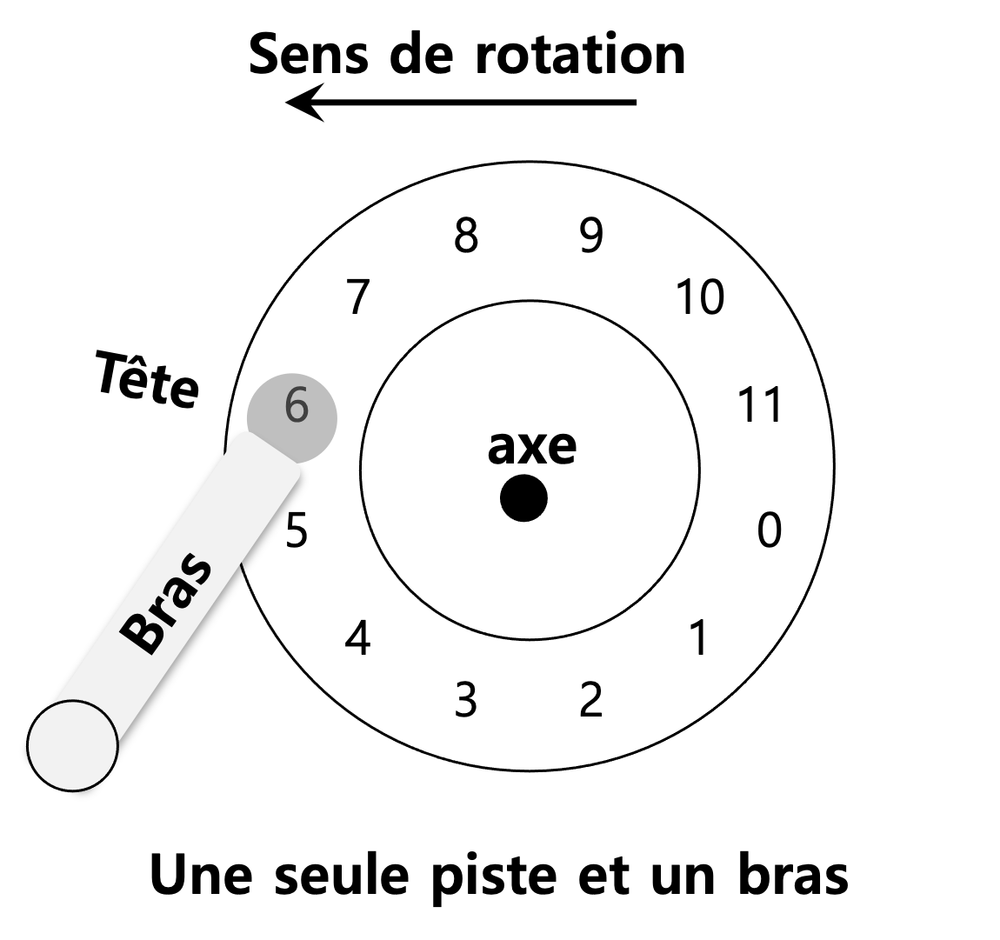
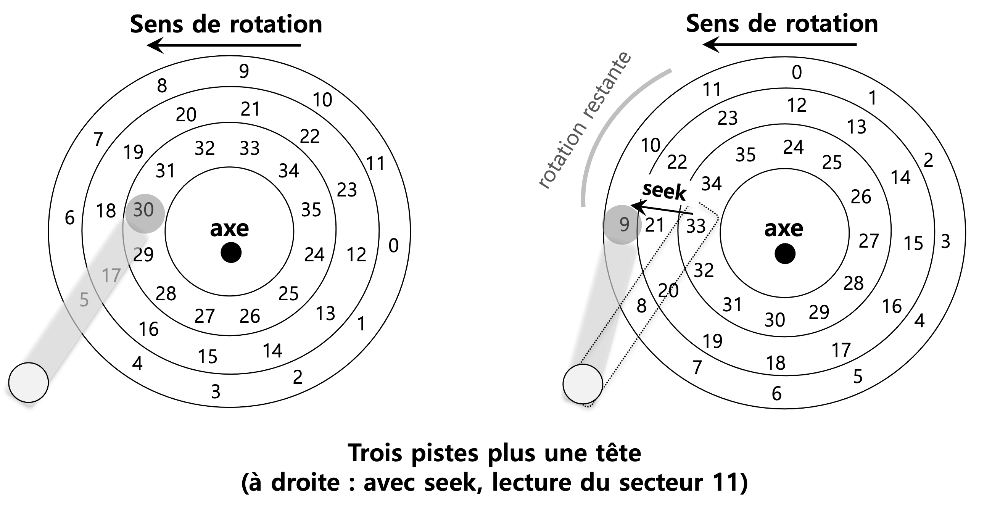
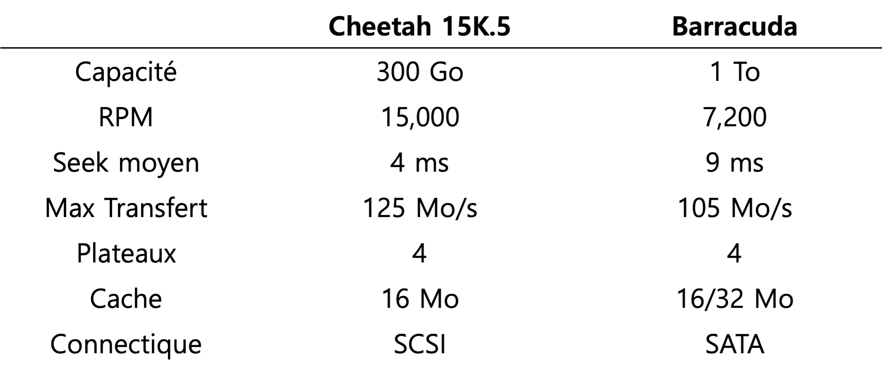
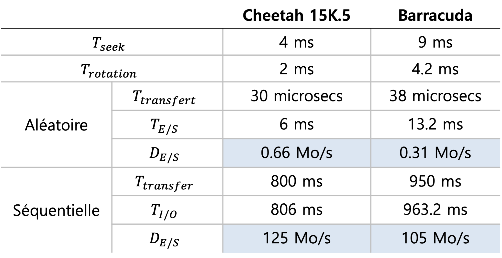

<!-- _class: lead -->

<!-- _header: L3 Informatique • 2022-2023 • Systèmes d'exploitation -->

# Persistence : 
# périphériques d'entrées-sorties

<br>

Thibaud Martinez
thibaud.martinez@dauphine.psl.eu

<!-- _footer:  -->

---

Cette présentation couvre les chapitres [36](https://pages.cs.wisc.edu/~remzi/OSTEP/file-devices.pdf) et [37](https://pages.cs.wisc.edu/~remzi/OSTEP/file-disks.pdf) de Operating Systems: Three Easy Pieces.

<br>

Les diapositives sont librement adaptées de diapositives de _Youjip Won (Hanyang University)_.

---

## Entrées-sorties (E/S)

* Imaginez un programme sans aucune entrée (il produit le même résultat à chaque fois).
* Imaginez un programme sans aucune sortie (quel était le but de son exécution ?)

&nbsp;&nbsp;&nbsp;&nbsp;**→ Les entrées-sorties sont essentielles pour les systèmes informatiques.**

<br>

_Défis :_ 

* Comment les E/S doivent-elles être intégrées dans les systèmes ? 
* Quels sont les mécanismes généraux ? 
* Comment les rendre efficaces ?

---

## Architecture d'un système informatique
\


Le processeur est reliée à la mémoire principale du système par un **bus mémoire**.
Certains dispositifs sont connectés au système via un **bus d'E/S général**.

---

* **Bus** : dispositif permettant de transmettre des données entre le(s) processeur(s), la mémoire vive et les périphériques d'E/S.

* **Bus d'E/S** : dispositif qui relie le(s) processeur(s) aux périphériques d'E/S.

### Pourquoi avons-nous besoin d'une telle structure hiérarchique ?
* **Physique** : plus un bus est rapide, plus il doit être court et moins il y a de place pour connecter des périphériques.
* **Coût** : un bus à haute performance coûte cher.

---

## Un périphérique canonique

Composants fondamentaux :
* L'**interface matérielle** permet au logiciel du système de contrôler son fonctionnement. 
* La **structure interne** dépend du périphérique.

<br>


---

## Interface matérielle du périphérique canonique

Composée de 3 registres :

* **`status`** : pour lire l'état actuel du périphérique (ex : _BUSY_).
* **`command`** : pour demander à l'appareil d'effectuer une certaine tâche.
* **`data`** : pour transmettre des données au périphérique ou récupérer des données.

<br>

En lisant et en écrivant dans ces registres, le système d'exploitation peut contrôler le périphérique.

---

## Exemple d'interaction du système d'exploitation avec le périphérique

```go
while (STATUS == BUSY)
    ; // attendre que le périphérique ne soit pas occupé
Write data to DATA register
Write command to COMMAND register
    (starts the device and executes the command)
while (STATUS == BUSY)
    ; // attendre que le périphérique ait traité votre demande
```

---

## Polling (attente active)

Le système d'exploitation **attend que l'appareil soit prêt** en lisant plusieurs fois le registre `status`.
\

→ Cette méthode est simple mais l'attente active fait perdre temps processeur.

---

## Interruptions

Mettre en **attente le processus** qui demande une E/S et exécuter un autre processus. Lorsque le périphérique a terminé, **réveiller** le processus qui attend l'E/S par une **interruption**.
\

→ Le processeur et le disque sont utilisés de manière efficiente.

---

## Faut-il privilégier le polling ou les interruptions ?

:warning: **Les interruptions ne sont pas toujours la meilleure solution.**

→ Si le périphérique termine son opération très rapidement, l'interruption "ralentira" le système. En effet, la commutation de contexte est coûteuse

<br>

<div class=frame>

Si un périphérique est **rapide** → privilégier le **polling**.
Si un périphérique est **lent** → privilégier les **interruptions**.

</div>

---

## Surcharge du processeur lors du transfert de données

_Problème_ : le processeur passe beaucoup de temps à **copier les données de la mémoire vers le périphérique**.
\


---

## Direct memory access (DMA)

* Le **DMA engine** copie les données en sachant où se trouvent les données en mémoire et quelle quantité copier.
* Une fois la copie terminée, le DMA engine déclenche une **interruption** pour indiquer à l'OS que le transfert est complet.
\


---

## Comment le système d'exploitation communique avec un périphérique ?

* **Instructions d'E/S** : permettent au système d'exploitation d'envoyer des données à des registres de périphériques spécifiques.
    _ex : instructions `in` et `out` sur x86._

* **Memory-mapped I/O** : les registres de périphériques sont disponibles comme s'il s'agissait d'emplacements mémoires.

    Pour accéder à un registre particulier, l'OS lit ou écrit à une adresse mémoire particulière ; le matériel achemine la lecture ou l'écriture vers le périphérique plutôt que vers la mémoire principale.

---

## Pilotes de périphériques

Comment faire en sorte que le système d'exploitation n'ait pas à se soucier des spécificités des périphériques avec lesquels il interagit ?

_Ex : on souhaite un système de fichiers qui fonctionne sur les disques SCSI, les disques IDE, les clés USB, etc._

<br>

→ _Solution_ : l'**abstraction**.

**Pilote de périphérique (_device drivers_) :** un morceau de logiciel qui encapsule les spécificités nécessaires à l'interaction avec un périphérique donné.

---

<style scoped>
p {
    font-size: 0.9em;
}
</style>

## L'abstraction du système de fichiers


<br>Un système de fichiers n'est pas conscient des spécificités de la classe de disque qu'il utilise ; il émet simplement des demandes de lecture et d'écriture de blocs à la couche générique, qui les achemine vers le pilote de périphérique approprié, qui gère les détails de traitement de la requête.

---

## Limites de l'abstraction

* Si un périphérique possède de nombreuses fonctionnalités spécifiques, celles-ci ne seront pas disponibles dans l'interface générique.

* Plus de **70 % du code du système d'exploitation se trouve dans les pilotes de périphériques**. Ces pilotes sont nécessaires pour supporter tous les périphériques qui peuvent être branchés sur le système.

    Ils sont les principaux responsables des pannes du noyau.

---

## Disques durs

Depuis des décennies, les disques durs constituent la principale forme de stockage de **données persistantes** dans les systèmes informatiques.

<br>

Le disque se compose d'un grand nombre de **secteurs** (blocs de **512 octets**).
* On peut considérer un disque avec `n` secteurs comme un tableau de secteurs allant de `0` à `n-1`.
* L'écriture d'un bloc de 512 octets est garantie comme **atomique**.

---

## Composants d'un disque dur

* **Plateau**

    * Surface circulaire en aluminium recouverte d'une fine couche magnétique.
    * Les données sont stockées de manière persistante en induisant des changements magnétiques.
    * Chaque plateau a deux faces, chacune étant appelée surface.

* **Axe**

    * Relié à un moteur qui fait tourner les plateaux.
    * La vitesse de rotation est mesurée en RPM (rotations par minute).
    Valeurs modernes typiques : 7 200 RPM à 15 000 RPM.
    _Par exemple, 10000 RPM : une rotation dure environ 6 ms_.

---

<div class="columns">
<div>

* **Pistes**

    * Cercles concentriques de **secteurs**.
    * Les données sont encodées sur chaque surface d'une piste.
    * Une seule surface contient des milliers de pistes.

</div>
<div>


</div>
</div>

---

<div class="columns">
<div>

<br>
<br>

* **Tête de lecture/écriture**

    * Le processus de lecture et d'écriture est accompli par la tête de disque.
    * Attachée à un bras qui se déplace sur la surface.
    * Une tête par surface.

</div>
<div>


</div>

---

## Structure d'un disque dur



---

## Délai de rotation

<div class="columns">
<div>

C'est le temps de rotation jusqu'au secteur souhaité.

<br>

Exemple : le délai de rotation complet est `R` et nous commençons au secteur `6`.
* Lecture du secteur `0` : 
    * délai de rotation = `R / 2`

* Lecture du secteur `5` : 
    * délai de rotation = `R-1` (cas le plus défavorable)

</div>
<div>



</div>

---

<style scoped>
p {
    font-size: 0.9em;
}
</style>

## Seek time

**Seek** : opération de déplacement de la tête sur la piste correcte.
→ une des opérations les plus coûteuses du disque (plusieurs ms).

**Seek time** : temps nécessaire pour déplacer la tête sur la piste contenant le secteur souhaité.



---

## Étapes d'une lecture/écriture sur le disque

1. Seek
2. Attente du délai de rotation
3. Transfère des données : les données sont lues ou écrites sur la surface.

---

## Cache

* Conserve les données lues ou à écrire sur le disque
* Permet au disque de répondre rapidement aux requêtes.
* Petite quantité de mémoire (généralement autour de 8 ou 16 Mo).

### Gestion des écritures

* **Writeback** : accuse réception d'une écriture lorsqu'il a placé les **données dans le cache** → risque de perte de données.

* **Write through** : accuse réception d'une écriture après qu'elle a été **réellement écrite sur le disque**.

---

## Mesurer la performance d'une E/S sur le disque

\
**Durée de l'E/S** :&nbsp;&nbsp;&nbsp;&nbsp;$T_{E/S} = T_{seek} + T_{rotation} +T_{transfert}$ 

\
**Débit de l'E/S** :&nbsp;&nbsp;&nbsp;&nbsp;$D_{E/S} = \frac{Taille_{transfert}}{T_{E/S}}$

---

## Accès aléatoire contre séquentiel

On considère deux types de disques durs.




**Charges de travail**

* **Lecture aléatoire** : lecture de 4 Ko vers des emplacements aléatoires du disque.
* **Lecture séquentielle** : lecture consécutive de 100 Mo sur le disque.


---

## Accès aléatoire contre séquentiel : résultats



→ **Il y a écart de performances très important entre la lecture aléatoire et la lecture sequentielle**. Il en serait de même pour l'écriture.

---

## Ordonnancement des requêtes d'E/S sur le disque

L'**ordonnanceur du disque** décide de l'ordre de traitement des requêtes d'E/S.

* **SSTF (Shortest Seek Time First)**
    *  Ordonne la file d'attente des requête d'E/S par piste.
    * Choisit les demandes sur la piste la plus proche pour les traiter en premier.

* **SCAN (Elevator)**
    * Balaye le disque d'une extrémité à l'autre.
    * Si une demande concerne un secteur sur une piste qui a déjà été desservie lors de ce balayage du disque, elle est mise en file d'attente jusqu'au balayage suivant.
    * F-SCAN et C-SCAN sont des variantes.

---

## Fusion des requêtes d'E/S

Réduit le nombre de requêtes envoyées au disque et diminue la charge de travail.

Par exemple, pour lire les blocs `33`, puis `8`, puis `34` →  l'ordonnanceur fusionne les requêtes pour les blocs `33` et `34` en une seule requête.

---

## Pour aller plus loin

* [Case study: A simple IDE disk driver](https://pages.cs.wisc.edu/~remzi/OSTEP/file-devices.pdf)

* [SSD](https://pages.cs.wisc.edu/~remzi/OSTEP/file-ssd.pdf) : une nouvelle forme de stockage persistent de plus en plus présente.
